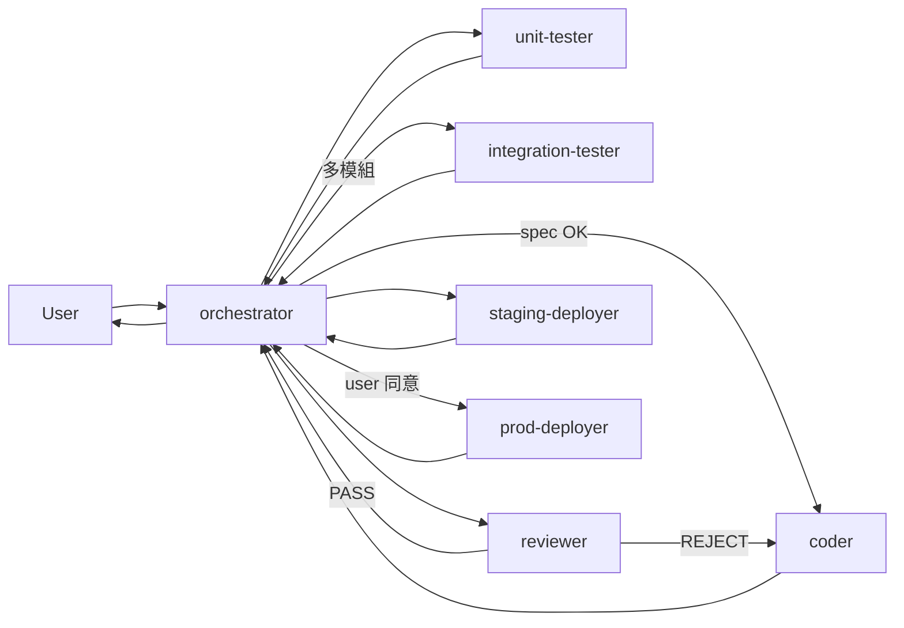

# MeetChi Multi-Agent Setup

7 個 subagent 構成完整 SDLC 自動化迴圈。User → Orchestrator → 其他 agent。

## Agent 名單

| Agent | 角色 | Model | Tools | 何時派發 |
|---|---|---|---|---|
| `orchestrator` | User 唯一窗口；訪談 / 分派 / 統籌 | opus | Read/Grep/Glob/Bash/Agent/TodoWrite/WebFetch | 任何 user 請求進來時 |
| `coder` | 寫 / 改 code | sonnet | Read/Edit/Write/Glob/Grep/Bash/NotebookEdit | spec 確認後 |
| `unit-tester` | 寫無依賴單元測試 | sonnet | Read/Edit/Write/Glob/Grep/Bash | coder 完成後 |
| `integration-tester` | 跨模組 / E2E 測試（可起本地 docker） | sonnet | Read/Edit/Write/Glob/Grep/Bash | unit-tester 全綠且任務涉多模組 |
| `reviewer` | 客觀 code review；無 Edit/Write | opus | Read/Grep/Glob/Bash | testing 全綠後 |
| `staging-deployer` | 部 staging + smoke test + 自動 rollback | sonnet | Bash/Read/Grep | reviewer PASS 後 |
| `prod-deployer` | 部 prod；canary + 觀察期；需 user confirmation token | opus | Bash/Read | user 明確同意後 |

## 標準循環



## 信任邊界

```
user
  └─ trusts → orchestrator
              └─ delegates to → coder / testers / reviewer / deployers
                                └─ report back to → orchestrator
                                                    └─ summarize to → user
```

- **User 不直接跟 coder/reviewer 對話**——由 orchestrator funnel
- **Subagent 不互相 spawn**——一律經 orchestrator
- **Subagent 不擴大 scope**——只做派發任務內的事

## 使用方式（使用者視角）

```
你: 「優化 RAG 的 query 延遲」

主對話會自動 dispatch 給 orchestrator（依 description 匹配）
↓
orchestrator 開始訪談：「目前延遲 p95 多少？目標 p95？什麼不能動？」
↓
你回答 → orchestrator 寫 spec → 派 coder → ...
↓
最後 orchestrator 回報你「等 prod 同意」
```

## 安全紅線（共同）

| 紅線 | 適用 agent |
|---|---|
| 不讀 `.env` / `secrets/*` / `credentials*` | 全部 |
| 不 push 到 origin/main 直接（一律走 PR） | 全部 |
| 不執行 `rm -rf` / `terraform destroy` / `DROP TABLE` 未經明確同意 | 全部 |
| 不對 prod service 動手未經 confirmation token | prod-deployer |
| 不 self-review（coder 不能 review 自己） | reviewer |
| Reviewer 不能改 code（無 Edit/Write 權限） | reviewer |

## 修改 / 客製化

- 改 system prompt：直接編輯對應 `.md` 檔
- 加 / 減 tools：改 frontmatter 的 `tools` 欄
- 換 model：改 frontmatter 的 `model` 欄（opus / sonnet / haiku）
- 加新 agent：新增 `.md` 檔，在 `orchestrator.md` 的分派表加一條

## 相依基礎建設（首次使用前須完成）

- [ ] backend `tests/` 目錄補測試（unit-tester 才有東西可跑）
- [ ] `meetchi-*-staging` Cloud Run service 建立（staging-deployer 才有目標）
- [ ] `gh` CLI 安裝（issue 與 PR 自動化）
- [ ] `docker-compose.yml` 在 root（integration-tester 才能起本地依賴）

## 第一次跑：最小循環測試

建議先丟一個小任務驗證循環跑得通：

```
你: 「在 routes/meetings.py 加一個 GET /api/v1/meetings/count endpoint，回傳會議總數」

預期 orchestrator 自動：
1. 訪談：「需要按 user 過濾嗎？要 cache 嗎？」
2. 寫 spec
3. 派 coder
4. 派 unit-tester
5. 派 reviewer
6. 派 staging-deployer
7. 等你同意 prod
8. 派 prod-deployer
```

跑通一次後再丟更大任務。
