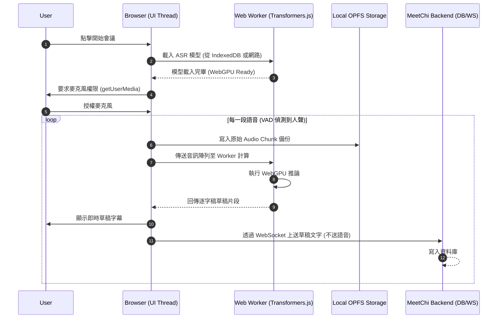
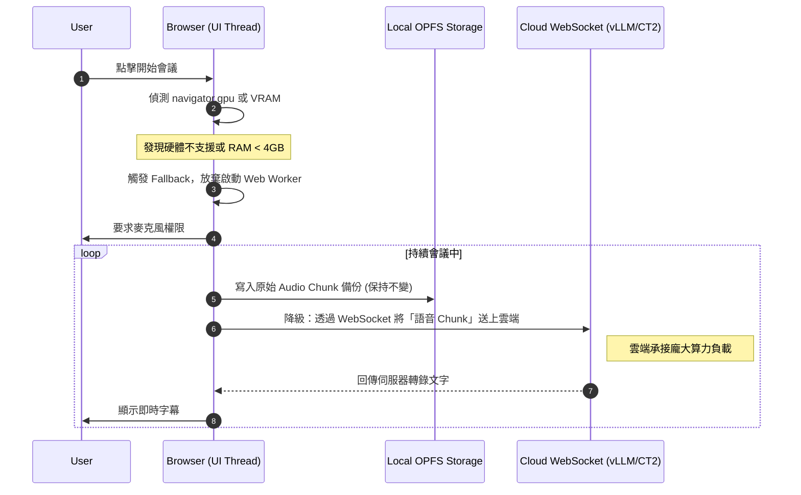
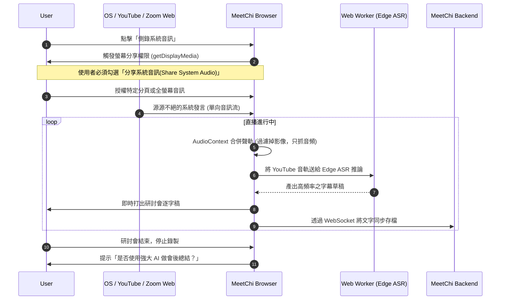
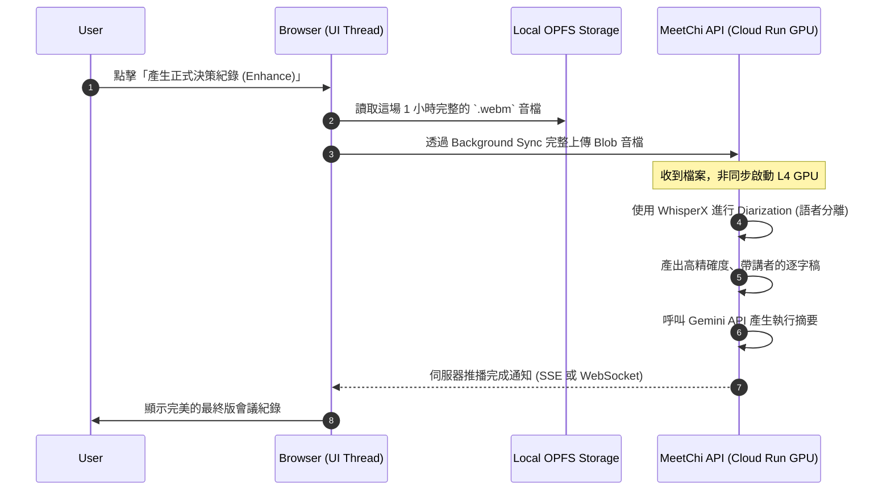

# MeetChi 方案 C (Edge-Cloud Hybrid) 系統衝擊與情境泳道圖

## 一、方案 C 導入對現有系統的重大更動 (System Impacts)

全面實施 **方案 C (邊緣預計算)** 將會對目前 MeetChi 的前後端架構進行翻天覆地的「責任重組」。以下為具體的工程更動點：

### 1. 前端 (Frontend / Browser) 重大更動
* **核心依賴引入**：必須導入 `@huggingface/transformers.js` 或 `onnxruntime-web`，並實作 **Web Worker** 來處理推論，避免 ASR 計算阻塞 React/UI 主執行緒。
* **模型管理快取層**：新增對 `.onnx` 模型檔的下載進度條與 IndexedDB 存取邏輯。
* **Audio Context 重組**：
  * **(現有)** 拿麥克風串流直接透過 WebSocket 噴給後端。
  * **(方案 C)** 必須在瀏覽器實作前端 **VAD (語音活動偵測)**，確認有人聲才把音軌切割 (Resample 至 16kHz) 餵給本地 WebGPU 模型。
* **全新權限獲取**：支援捕捉系統音效 (`getDisplayMedia`)，以適應「側錄線上研討會」的新情境。
* **OPFS 離線儲存系統**：前端須負責將收音持續寫入硬碟沙盒，並在網路斷線時處理續傳狀態機。

### 2. 後端 (Backend / Cloud Run) 重大更動
* **WebSocket 退居二線**：後端 WebSocket 的職責從「接音檔轉錄」降級為「純接收前端傳來的草稿文字並寫入 DB」。ASR 算力負載直接歸零。
* **新增按需處理腳本 (Enhance API)**：實作 `/api/enhance-transcript`，當前端拋上完整音軌與 OPFS 憑證時，才啟動大模型 (如 Whisper Large V3) 進行高質量校對。

---

## 二、情境泳道圖 (Sequence Diagrams)

### 情境一：標準麥克風會議 (Edge WebGPU 正常運行)
當使用者的電腦硬體足以支撐 WebGPU，全程零伺服器 ASR 成本運作的情境。

### 情境二：低端設備防護 (硬體不足或當機，靜默降級至雲端)
使用者使用舊手機或是無 GPU 支援的電腦，系統發動 Progressive Enhancement 防禦機制。

### 情境三：側錄線上研討會 / YouTube (擷取系統音效)
這是全新的被動使用情境，使用者主要不是說話，而是「偷錄」電腦上正在播放的直播或外語教學影片。

### 情境四：會後精修 (Draft-and-Enhance Pattern)
利用邊緣端產出的「有瑕疵草稿」無法滿足正式會議紀錄，使用者觸發 Phase 3 的斷點續傳與雲端大模型精修。

