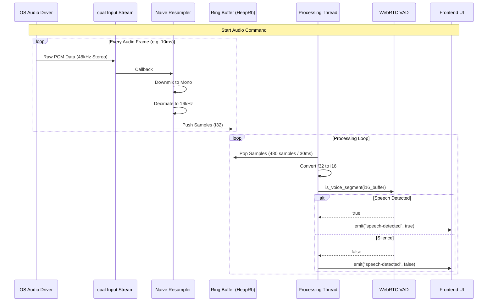
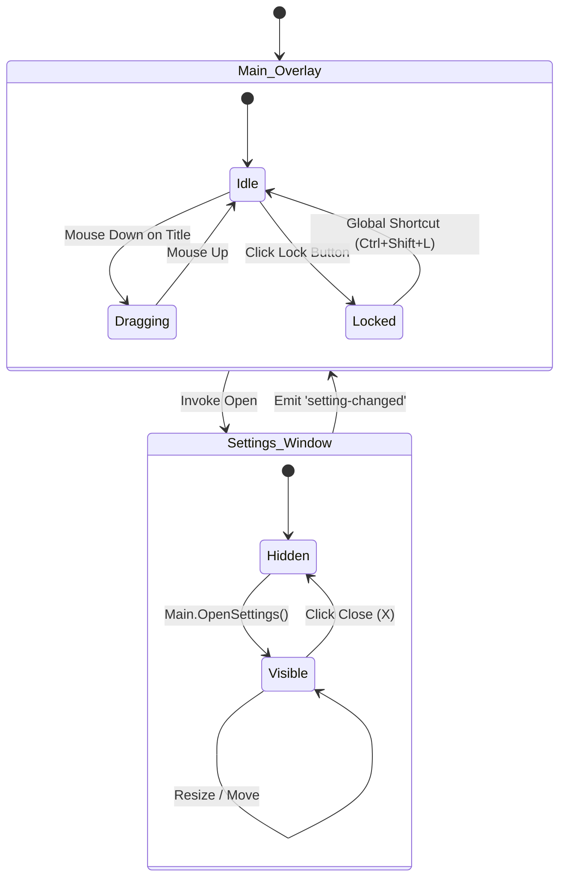

# 系統架構視覺化文件 (System Architecture Visualization)

**版本**: 1.0 (Sprint 4.8 Final)
**日期**: 2025-12-22

本文件提供了 TranscriptHub Desktop 目前實作狀態的架構視圖，旨在協助開發者理解系統邊界、資料流向與關鍵組件互動。

## 1. 高層次架構 (High-Level Architecture)

```mermaid
graph TB
    subgraph "Frontend (Next.js / TypeScript)"
        UI_Main[Main Window (Overlay)]
        UI_Settings[Settings Window]
        React_State[React State (Zustand/Context)]
    end

    subgraph "Tauri Core (Rust)"
        Tauri_App[Tauri Application]
        Cmd_Handler[Command Handler]
        Event_System[Event System]
    end

    subgraph "Audio Engine (Rust)"
        Audio_Proc[AudioProcessor]
        CPAL[cpal (Audio I/O)]
        VAD[WebRTC VAD]
        RingBuf[Ring Buffer]
    end

    subgraph "OS / Hardware"
        Mic[Microphone]
        Loopback[System Loopback]
        Windows_API[Windows API]
    end

    UI_Main -- "Invoke / Listen" --> Tauri_App
    UI_Settings -- "Invoke / Listen" --> Tauri_App
    Tauri_App -- "Manage State" --> Audio_Proc
    Audio_Proc -- "Capture" --> CPAL
    CPAL -- "Raw PCM" --> Mic
    CPAL -- "Raw PCM" --> Loopback
    Audio_Proc -- "Process" --> VAD
    VAD -- "Emit 'speech-detected'" --> Event_System
    Event_System -- "Update UI" --> UI_Main
```

## 2. 音訊處理管線 (Audio Processing Pipeline)

此圖詳細描述了音訊數據如何在 Rust 後端流動。



## 3. 視窗管理與事件流 (Window Management)

此圖展示了主視窗與設定視窗的生命週期與互動。



## 4. 關鍵技術堆疊 (Tech Stack)

### Frontend
*   **Framework**: Next.js 14+ (App Router, SSG)
*   **UI Library**: Tailwind CSS, Lucide React
*   **State**: React Hooks (useState, useEffect, useRef)
*   **Communication**: `@tauri-apps/api` (core, window, event)

### Backend (Rust)
*   **Core**: `tauri` v2
*   **Audio I/O**: `cpal` 0.15.3 (features: WASAPI)
*   **VAD**: `webrtc-vad` 0.4
*   **Concurrency**: `std::thread`, `std::sync::mpsc`, `ringbuf` 0.4.8
*   **Error Handling**: `anyhow` 1.0
*   **Plugins**:
    *   `tauri-plugin-global-shortcut` (for unlock)
    *   `tauri-plugin-log` (for debugging)
    *   `tauri-plugin-fs`, `shell`, `process` (standard suite)

## 5. 目前已知限制與待辦事項 (Debug & Future)

*   **VAD 靈敏度**: 目前僅透過簡單的浮點數映射到 WebRTC 的 4 個模式。可能需要更細緻的能量預過濾。
*   **重採樣品質**: 目前使用 Naive Decimation (簡單抽樣)，在 44.1kHz -> 16kHz 時可能會引入混疊雜訊 (Aliasing)。建議未來引入 `rubato` 進行高品質重採樣。
*   **Loopback 穩定性**: 在某些 Windows 驅動下，Loopback 採集可能會失敗或靜音，需增強錯誤恢復機制。
