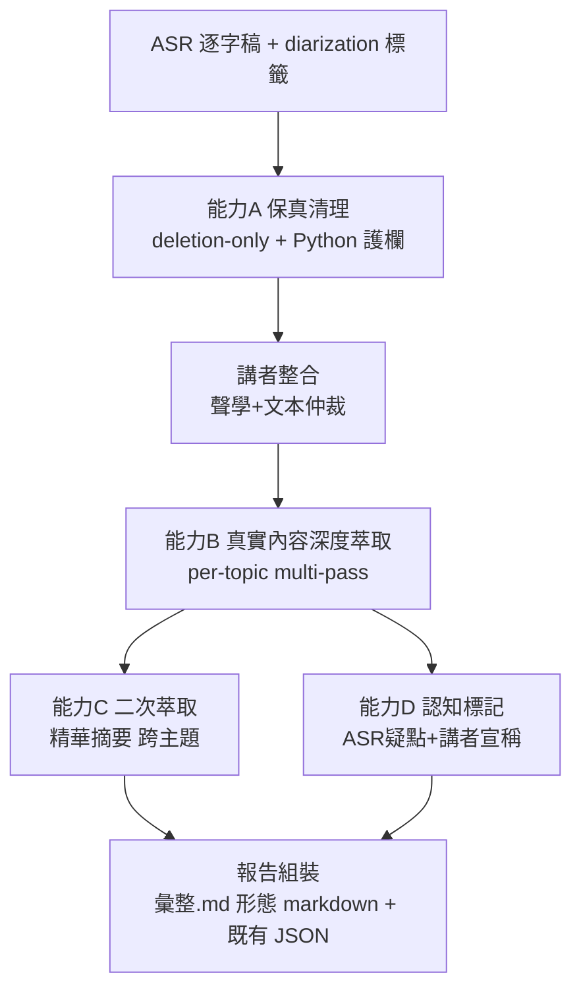

# MeetChi 逐字稿深度報告升級 — 規劃文件

> **文件性質**：實作規劃（本文件於個人環境撰寫，實作於公司內部環境執行）
> **目標**：讓 MeetChi 對 ASR 逐字稿，產出接近「未來商務展 `彙整.md`」等級的**單場深度報告**
> **撰寫日**：2026-07-10 ｜ **基準分支**：`main`（commit `c138219`）
> **標竿樣本（in-repo）**：[`reference-quality-benchmarks.md`](./reference-quality-benchmarks.md) §1.2（原始檔在 repo 外：`202606024 未來商務展\01_簡立峰...\彙整.md`）

---

## 0. 範圍界定（先講清楚不做什麼）

| 面向 | In Scope ✅ | Out of Scope ❌ |
|---|---|---|
| 資料來源 | **只有 ASR 逐字稿**（+ 既有 diarization 講者標籤） | 網路查證、外部資料庫、簡報 OCR、web search |
| 內容產出 | 保真清理 + 真實內容深度萃取 + 二次萃取 | 標竿檔的「🔍 額外調查內容（含來源）」整段 |
| 認知標記 | **內部**判斷：ASR 疑點、講者宣稱歸屬 | 「✅確認 / ⚠️修正 / ❓查無」的**外部佐證** |

> 標竿 `彙整.md` 由 Claude Code agentic session 產出，含 8 個研究代理的 web 查證。**MeetChi 版本只取其中「📝 講者原始內容」與「精華摘要（二次萃取）」兩層的深度與保真度**，捨棄所有需要外部世界知識的部分。這是本規劃唯一且明確的邊界。

**一句話目標**：把 MeetChi 從「產一份 20-30 字空洞 bullet 的 JSON 摘要」升級為「產一份逐主題、保真、不失真、保留所有具體資訊（數字/人名/例子/類比）的深度報告」。

---

## 1. 標竿等級的結構拆解（what "good" looks like）

以標竿樣本 `01_簡立峰/彙整.md` 為例，in-scope 的目標結構是**兩層**：

### 層 1：精華摘要（二次萃取）
- 5 條 thesis bullet，每條是一個**濃縮論點**，含關鍵 specifics。
- 例：「**B2B 採購自動化是最先被翻天覆地的戰場**：簡立峰引 Gartner，2028 年 90% 的 B2B 採購都將涉及 AI 代理、影響規模逾 15 兆美元…核心警語——供應商若『不被 AI 讀懂…就會從供應鏈消失』。」

### 層 2：📝 講者原始內容（本升級的核心目標）
- ~15 條「**粗體論點.** 忠實展開」的 bullet，每條 100-250 字。
- **完整保留**講者實際說的：數字（一人抵十/百/千人、5 億美金、7 年→2 年、6 個月→2 週、2 萬多外籍白領）、人名/機構（台積電、Gartner、統一/台達電/鴻海）、例子與類比（哆啦A夢、把地圖轉 90 度、Beyond Hardware、心臟與腦）。
- **保真但乾淨**：讀起來通順（無 ASR 冗詞噪音），但用詞、語氣、論證結構忠於講者。
- **內部認知標記**（in-scope 版）：
  - `（現場 ASR 一度出現「20%」…）` ← ASR 內部矛盾/疑點標記（同場稍後出現 90%）
  - `（此「5 億美金」為講者口述）` ← 講者宣稱歸屬（**不判真假**，只標明這是講者說的、非既定事實）

### 目標形態與現況的落差

| 維度 | 現況 MeetChi | 目標等級 | 落差 |
|---|---|---|---|
| 產出粒度 | bullet 20-30 字（`template_engine.py:415`）| thesis-paragraph 100-250 字 | **8-10 倍資訊密度** |
| specifics 保留 | uniform sampling 隨機丟（`llm_utils.py:494`）| 全數保留 | 結構性缺失 |
| 逐字稿保真 | 無清理步驟；`polish_text` 潤稿會改寫 | 保真清理（deletion-only） | **能力不存在** |
| 內容忠實度 | 「生成重點」易空洞/幻覺 | 「抽取真實內容」+ 認知標記 | 框架錯誤 |
| 輸出形態 | 單一 JSON | 兩層報告（精華 + 原始內容） | 需組裝層 |
| 講者標籤 | 有雙機制但未仲裁（`tasks.py:301` + `infer_speaker_roles`）| 跨 chunk 同一人正確歸併 | 需強化 |

---

## 2. 差距分析（第一性原理）

> 完整分析見本次 workflow 深度診斷；此處濃縮為與本目標直接相關的四個根因。

1. **長度契約 ≠ 資訊契約**：現行 prompt（`SUMMARY_V2_REQUIREMENTS`、`long_meeting_addendum` @ `template_engine.py:329-424`）全是字數/條數約束，沒有任何一條要求輸出攜帶具體實體。模型可 100% 遵守長度卻 0 specifics → 空洞。要達標竿等級，必須改簽「具體性契約」。

2. **均勻抽樣在入模前丟掉 specifics**：`llm_utils.py:494-512`、`multi_pass_summary.py:94,176-181` 的 `lines[::step]` 對「嗯對對對」和「預算 500 萬」給相同保留機率。specifics 在 prompt 之前就被隨機丟掉，任何 prompt 救不回。標竿等級要求全保留 → 必須改 entity-preserving 抽樣，或長會議完全不抽樣（走 per-topic 分段）。

3. **沒有保真清理步驟**：pipeline 內唯一潤飾入口 `polish_text`（`llm_utils.py:785`）寫「潤色更通順」+ temp 0.3 + 綁翻譯 → 把 autoregressive 模型推向「重寫」而非「刪除」，抹平語氣、可能幻覺。標竿的「📝 講者原始內容」讀起來乾淨卻保真，正是需要一個**只刪不改寫**的清理步驟。

4. **「精簡優先」把濃縮做成稀釋**：`template_engine.py:417`「你寧可少列重點也絕對不能讓 JSON 被截斷」只 cap 數量不 cap 品質，長會議最重要的 mega-topic 反被 `topic_text[:15000]`（`multi_pass_summary.py:181`）砍最兇。標竿等級要求逐主題**詳盡**，與此完全相反 → 必須改「per-topic 各自有預算」的架構。

---

## 3. 解法架構（MECE：四能力 + 一組裝）



| 能力 | 對應問題 | 核心手段 | 落點 |
|---|---|---|---|
| **A. 保真清理** | 逐字稿潤飾 | deletion-only prompt（temp 0）+ Python 子序列/不可刪 token 護欄 | 新增步驟 + 機械護欄 |
| **B. 真實內容深度萃取** | 摘要（重校準為深度）| 資訊契約 + thesis-paragraph 格式 + per-topic 生成 | 改寫 multi-pass Pass1 |
| **C. 二次萃取** | 摘要精華層 | 讀各主題精華 → 跨主題洞察（本場內，無 web）| 改寫 Pass2 |
| **D. 認知標記** | 保真/誠實 | 內部一致性偵測（ASR 矛盾）+ 講者宣稱歸屬 | prompt + 後處理 |
| **組裝** | 輸出形態 | 產 markdown 報告（彙整形態）+ 維持既有 JSON 供前端 | 新增 export |

---

## 4. System Prompt 設計（三份 + Gemini 相容性）

> 三份 prompt 皆走 `client.models.generate_content(model, contents, config)`。相容性重點：`response_mime_type="application/json"` + `response_schema`（Pydantic）+ `temperature` + `max_output_tokens ≤ 65535`。**不在 schema 加巢狀 `maxItems`**（Gemini FSM validator 會 400），list 上限靠 Python 截尾。建議把 system 段改用 config 的 `system_instruction=` 參數（現況是字串串接，改用專屬參數指令遵從度更高）。

### Prompt A — 保真清理（deletion-only）
**用途**：ASR 逐字稿 → 乾淨但保真的文字。**temperature = 0**。輸出 schema `{"edits":[{"id","text"}]}`（新建，取代 `PolishResult`）。

```
你是逐字稿的「保真清理員」，不是潤稿員、編輯，也不是翻譯。你唯一的工作是刪除語音
辨識(ASR)產生的口語噪音，讓文字更好讀，同時讓每一位說話者聽起來仍然是他本人。
禁止使用任何「潤色、潤飾、通順、優化」式的改寫。

# 鐵則（違反任一條即視為失敗）
1. 你只能「刪除」中文字詞，以及「補上標點（，、。？！）來斷句」。除此之外禁止任何
   操作：不得改字、不得換同義詞（「可以」不得改「能夠」）、不得調語序、不得增字、
   不得合併或拆分句子、不得跨段搬移文字。
2. 子序列不變式：把你保留的中文字（忽略標點）依原順序接起來，必須完全出現在原句中。
   只要有一個字對不上，就代表你改寫了，屬於失敗。
3. 寧留勿刪：不確定某字該不該刪，一律保留。清理強度 light。漏刪只是不夠漂亮、事後
   可救；誤刪會永久破壞語意，代價不對稱。

# 可以刪除（純噪音）
- 非詞彙填充音：嗯、呃、啊、痾、唔、欸（單獨出現且不承載語氣時）。
- ASR 口吃重複：「我我我覺得」→「我覺得」。
- 被打斷後放棄的殘句碎片：「我要…啊不對，我想說的是X」→ 只留「我想說的是X」。
- 句中冗餘接續詞：「然後」「就是」「那個」（純卡頓時）。

# 絕對不能刪除（語氣與語意指紋）
- 否定詞與量詞：不、沒、沒有、別、只、都、全部（刪了會反轉命題真假，最嚴重）。
- 猶豫 hedge：可能、應該、大概、我覺得、好像、也許。
- 句尾語氣助詞：啦、喔、吧、嘛、耶、齁。
- 刻意強調的重複：「真的真的很重要」「非常非常」。
- 表態度口頭語：其實、老實說、坦白講、反而。
- 人稱代名詞、數字、專有名詞，及任何會改變命題真假的字。

# 輸入與輸出
- 輸入是「同一位說話者、時間相鄰」的片段陣列 [{"id":"...","text":"原文"}]。
- 逐段獨立處理，禁止用整場理解去補全任何一段。
- 只輸出 JSON：{"edits":[{"id":"...","text":"清理後全文"}]}，只放實際有刪改的段。
- 某段清理後全空（整段只有「嗯」），text 輸出 ""，但不要刪除該筆元素。
```

**Gemini 相容性**：✅ 完全相容。新建 `EditList` Pydantic schema；temp 0 支援；batch 只放同一 speaker 相鄰段（跨講者搬字架構上不可能）。**enforcement 靠 Python 後處理**（見 §5），prompt 只是軟提示。

### Prompt B — 真實內容深度萃取（per-topic，達標竿等級的核心）
**用途**：某主題的乾淨逐字稿片段 → 該主題的「精華摘要 + 講者原始內容」。**temperature = 0.2**。**per-topic 呼叫**（每主題獨立預算，故可產出 thesis-paragraph 而不撞 MAX_TOKENS）。

```
你是「會議內容深度萃取器」，不是撰稿人也不是摘要器。你的任務是把某一主題段落的逐字
稿，忠實重組為「讀者不必聽錄音就能完整掌握講者論點」的深度內容。嚴禁新增、推論、
或潤飾講者沒說的東西；也嚴禁把講者的具體內容壓縮成籠統套話。全程繁體中文。

# 0. 忠實性鐵則（優先於一切）
1. 只能根據逐字稿實際內容作答，沒說的不得補寫、不得推測、不得用常識填補。
2. 講者的數字、人名、機構、案例、比喻、類比，一律完整保留，不得省略或抽象化。
3. 你的角色是「忠實的轉述者」：用更清楚的組織呈現講者說過的話，而不是「評論」或
   「加值」。

# 1. 具體性契約（每個輸出單元都必須攜帶區分性資訊）
每一條內容至少攜帶一個「可查證的具體資訊」：數字（含中文寫法「三千五」「兩成」）、
人名或明確角色、日期時程、明確的主張/決定/立場、或講者舉的具體案例/比喻。
判斷法則：把這句抽掉，讀者會不會漏掉講者實際講過的具體東西？會，就必須保留。

# 2. 禁用套話（出現即改寫或刪除）
禁止「進行了深入討論」「強調了重要性」「涵蓋多個面向」這類換到任何演講都成立的空話。
✗「講者談了 AI 對產業的影響」
✓「講者說藥物研發可從 7 年縮短到 2 年、建築設計從 6 個月縮到 2 週（此為講者口述）」

# 3. 輸出兩層
（A）精華摘要：2-5 條 thesis bullet，每條是一個濃縮論點 + 關鍵 specifics。
（B）講者原始內容：多條「粗體論點 + 忠實展開」的段落，每條 80-250 字，涵蓋此主題
    講者說過的每一個重要論點、案例、數字。此層要「詳盡」——寧可多寫一條，不要漏掉
    講者實際講過的具體內容。此層不設嚴格條數上限（受限於單主題篇幅自然收斂）。

# 4. 認知標記（僅依逐字稿內部判斷，不做外部查證）
- 講者宣稱的量化數據 / 個案，標「（講者口述）」或「（講者宣稱）」，讓讀者知道這是
  講者的說法、非既定事實。你不需要、也不得判斷其真假。
- 若同一主題內講者對同一數字前後不一致（如先說 20% 後說 90%），兩者都保留並標
  「（逐字稿此處數字前後不一：20% / 90%，疑 ASR 誤植，待人工確認）」。
- 明顯疑似 ASR 誤植的專有名詞（音近亂碼、上下文不通），標「（疑 ASR 誤植）」，但
  不要自行猜測正確寫法。

# 5. 原話保留（key_quotes）— 對此欄位你是複製貼上機器
- text 必須是逐字稿中「連續、未修改」的原文：可截頭尾，中間不得刪字/合併/改寫。
  口語填充、數字原始寫法、專有名詞、中英夾雜一律保留原樣。
- 只放 (a) 單一講者完整說出、(b) 含具體資訊或鮮明立場、(c) 抽掉會失真 的句子。
- 找不到符合的就回傳 []，嚴禁自行生成看似口語的假引言。

# 6. 講者標籤
標籤 SPEAKER_NN_cM，cM 是音檔分段編號，同一人跨 chunk 可能被標成不同 NN。已由系統
建立跨 chunk 對應表；撰寫時用 display_name。display_name 須有逐字證據，不足時填
「講者（身份未明）」，禁止臆測姓名職稱。

# 7. 輸出前自我檢查
[ ] 每一條都能在逐字稿指出對應原句？不能的刪掉。
[ ] 講者講過的數字/人名/案例/比喻，有沒有漏掉？漏了補回。
[ ] 有無通用套話？有就改具體。
[ ] key_quotes 是否逐字、未改寫、確為連續原文？
```

**Gemini 相容性**：✅ 相容。schema 需含 `essence`（精華，list）、`speaker_content`（深度內容，list of {point, elaboration}）、`key_quotes`（{speaker,text,time}）、`asr_flags`（認知標記，list）。**注意**：`speaker_content` 是本升級新增的富內容欄位；因走 per-topic，單次輸出遠低於 65535，不會截斷。**「輸出前自我檢查」在結構化輸出下模型只能吐 JSON、不能顯示 checklist → 屬內部軟引導**；若要硬保證，改兩段式（生成→自評）但多一次呼叫。

### Prompt C — 二次萃取（精華摘要，跨主題但限本場）
**用途**：所有主題的「精華」→ 全會議的跨主題洞察。**temperature = 0.2**。輸出小（~5K token）。

```
你是「跨主題洞察萃取器」。以下是同一場會議各主題的精華摘要。請找出「跨越多個主題的
共同母題、呼應、或張力」，產出全會議層級的洞察。

# 規則
1. 只能根據提供的各主題精華，不得引入會議以外的知識或外部事實。
2. 每條跨主題洞察必須點名它橫跨哪幾個主題（如「主題 3、4、5 共同指向…」），並帶
   具體內容，不得是「本次會議討論很豐富」這類空話。
3. 若各主題其實各自獨立、無跨主題母題，就誠實少列，不要硬湊關聯。
4. 保留講者宣稱標記：跨主題洞察引用到的量化數據，沿用原標記（講者口述）。
```

**Gemini 相容性**：✅ 相容。schema `{"cross_topic_insights":[{"insight","spanning_topics"}]}`。

---

## 5. Python 機械護欄（能力 A 的最終防線，補 Gemini schema 盲區）

Gemini FSM 只能約束型別/結構，**無法表達「輸出是否為輸入的子序列」這種跨欄位語意約束** → 保真的最終防線只能是 Python 後處理（與「list 上限只能靠 post-process 截尾」同一結構性教訓）。

| 護欄 | 檢查 | 違反處置 |
|---|---|---|
| 子序列驗證 | clean 去標點後的 CJK 序列，必須是 raw 去標點後的子序列（O(n) 雙指標）| 丟棄該 edit、fallback 原文、`logger.warning` |
| 不可刪 token 存在性 | raw 內的否定詞（不/沒/別）、hedge（可能/應該）、句尾助詞（啦/喔/吧）是否在 clean 消失 | 消失即 reject（防「我不同意→我同意」這類合法子序列但災難級扭曲）|
| 長度下界閘 | `len(clean) < len(raw)*0.6`（去標點）視為過度刪除 | reject fallback |
| id ⊆ 輸入 | 輸出 edits 的 id 必須是輸入子集 | 非法 id 丟棄 |

> ⚠️ 子序列驗證會**放行**否定詞/hedge 的刪除（給偽安全感）→「不可刪 token 存在性檢查」是**必要**的補充，不可省。

---

## 6. Pipeline 與資料流變更

### 現況 → 目標
```
現況：ASR → (uniform sample) → generate_summary / multi_pass → 單一 JSON → 前端
目標：ASR → 保真清理(+護欄) → 講者整合 → per-topic 深度萃取 → 二次萃取
          → 認知標記後處理 → 【報告組裝 markdown + 既有 JSON】→ 前端 + 下載
```

### 與現有 multi-pass 的對應
| 現有 | 改法 |
|---|---|
| `_pass0_segment_topics`（`multi_pass_summary.py:85`）| 保留（主題切段），但改吃**清理後**逐字稿；`needs_split` 要真的遞迴再切 mega-topic（現在生成卻沒被讀）|
| `_pass1_summarize_topic`（:165）| **改寫為 Prompt B**（深度萃取），移除 `topic_text[:15000]` 硬截，per-topic 給足預算 |
| `_pass2_merge`（:272）| **改寫為 Prompt C**（二次萃取），merge context 帶各主題 essence + key_quotes 全文（不只 bullets[:5]）|
| `lines[::step]` 抽樣 | 改 entity-preserving，或長會議走純 per-topic 分段不抽樣 |

---

## 7. Schema / 資料模型變更

| 變更 | 位置 | 相容性 |
|---|---|---|
| 新 `EditList` schema（保真清理輸出）| `llm_utils.py` | 新增，不影響既有 |
| `SpeakerContribution.speak_time_pct` → `Optional[float]=None` | `llm_utils.py:152` | **必改**（解 Prompt B「不估算」與必填 float 的衝突）；向後相容 |
| Chapter 新增 `speaker_content: List[{point,elaboration}]`、`asr_flags: List[str]` | `llm_utils.py` Chapter | Optional，前端不渲染舊資料不爆 |
| segment 新增衍生欄 `text_clean`（raw 不可變）| DB model + **alembic migration** | 高風險，進 worktree |
| markdown 報告匯出 | 新增 export 函式 + 端點 | 新增 |

---

## 8. 落地階段規劃（DoD / 風險 / 回滾）

> 原則：純加法先做、可逆優先、綠燈才 commit（`[verified]`）、高風險進 `git worktree`、昂貴 API 加冪等卡榫。

| Phase | 內容 | 風險 | DoD | 回滾 |
|---|---|---|---|---|
| **0 地基** | 釘基準分支；建 golden fixture（§9）；建 P2 迷你 ground-truth 集 | 無（不改行為）| fixture + eval script 可跑出 baseline 分數 | 刪分支 |
| **1 深度萃取 prompt** | Prompt B/C 換入 Pass1/Pass2；移除 `topic_text[:15000]` 與精簡 addendum；`speak_time_pct` 改 Optional | 低（prompt+schema）| 對 fixture + 1 場真實長會議：thesis-paragraph 產出、specifics 保留率↑、JSON 不截斷 | git reset last-green |
| **2 前處理** | entity-preserving 抽樣取代 `lines[::step]`；`speak_time_pct` 改 Python 算；key_quotes 子字串驗證 | 中（中文正則漏判）| specifics 保留率再↑；regen 有上限不成 retry storm | reset |
| **3 保真清理**（進 worktree）| 新 `EditList` + 清理函式（Prompt A, temp 0）；Python 護欄（§5）；`text_clean` 衍生欄 + migration | 高（資料遷移）| ground-truth over/under-clean 達標；「我不同意→我同意」被擋下；下游不退化 | 刪 worktree |
| **4 講者整合** | 量 pyannote cosine 分布；30s overlap 錨點；precision-first 仲裁 | 中 | 跨 chunk 同一人歸併正確率↑；over-merge 為零 | reset |
| **5 報告組裝** | markdown 匯出（彙整形態）+ 下載端點 | 低 | 產出檔與標竿結構對齊（兩層 + 認知標記）| reset |

**建議順序理由**：Phase 1（純 prompt，立即見效、可逆）→ Phase 2/5（Python 加法）→ Phase 3（資料遷移，最高風險，隔離）。符合「一次一件事」。

---

## 9. 驗收標準（DoD）與 Golden Fixture

### Golden Fixture（讓「深度且保真」可計算）
把標竿樣本**去識別化後**存入 repo，作為標準答案與跨模型基準：
```
tests/fixtures/golden/future_business_expo_01/
├── transcript_raw.txt          # 該場 ASR 原始逐字稿（若可取得；否則用 .txt）
├── expected_report.md          # 認可的「精華摘要 + 📝 講者原始內容」（去識別化）
└── must_capture_anchors.yaml   # 「深度報告必須命中的具體事實」清單
```
`must_capture_anchors.yaml` 範例：
```yaml
anchors:
  - {type: number,  value: "2028 年 90% B2B 採購 / 15 兆美元"}
  - {type: number,  value: "藥物研發 7 年→2 年"}
  - {type: analogy, value: "把地圖轉 90 度 / 印太樞紐"}
  - {type: claim,   value: "律所花 5 億美金訓練模型（講者口述）"}
  - {type: concept, value: "Beyond Hardware / 借硬體之力"}
```

### 量化指標
| 指標 | 定義 | 目標 |
|---|---|---|
| `anchor_hit_rate` | 命中錨點數 / 總錨點數 | 治「漏 specifics」，越高越好 |
| `specificity_density` | 含數字/具名實體的內容單元佔比 | 治「空洞」，設閾值（如 ≥0.6）|
| `subsequence_pass_rate` | 保真清理通過子序列+不可刪 token 檢查的比例 | 治「幻覺/改寫」，趨近 100% |
| `over/under_clean_rate` | 對 ground-truth 的過度/不足清理比例 | 治「潤飾破壞」|

### 實際驗證（你 CLAUDE.md DoD 紅線）
改完 prompt/pipeline 後，**實跑一場真實會議**，人工比對輸出是否達 `彙整.md` 的「📝」層深度與保真度；型別/單元測試通過不算最終驗證。

---

## 10. 風險與限制（誠實揭露）

| 風險 | 說明 | 緩解 |
|---|---|---|
| **ASR 錯誤地板** | 無 web 查證下，ASR 把「玳能」聽成「佳能」、數字聽錯，MeetChi **無法自動修正**，只能標「疑 ASR 誤植」 | 認知標記讓讀者警覺；glossary（`correct_segments_glossary_llm` 已存在）可修已知專有名詞 |
| **exhaustiveness 量不出** | anchor 命中率只驗「該有的有沒有」，驗不出「漏了哪個主題」（完整主題集未知）| 誠實記錄為已知量測缺口，不假裝閉環 |
| **token/成本** | 深度萃取（富輸出）+ 多 pass + 保真清理逐段 → Vertex 呼叫數上升 | per-topic 各自低於 65535 不截斷；昂貴 API 加冪等卡榫防重複扣費 |
| **子序列偽安全** | 否定詞刪除是合法子序列 | 必配「不可刪 token 存在性檢查」|
| **講者合併門檻未校準** | 0.65 憑感覺 | Phase 4 先量測 cosine 分布再定 |
| **認知標記的邊界** | in-scope 版只能標「講者宣稱」（歸屬）與「ASR 內部矛盾」（一致性），**不能判真假** | 明確告知使用者：這不是查證，是誠實標註不確定性 |

---

## 11. 附錄：目標樣本結構（節錄）

標竿 `01_簡立峰/彙整.md` 的 in-scope 結構（供實作對照）：
```
# 標題（講者｜講題）
> 活動/錄音 meta ｜ 標記說明

## 精華摘要（二次萃取）      ← 層 1（Prompt C 產）
- **論點**：濃縮 + specifics ×5

## 📝 講者原始內容            ← 層 2（Prompt B 產，本升級核心）
- **粗體論點.** 忠實展開，保留數字/人名/案例/類比，100-250 字 ×~15
  （含內部認知標記：（講者口述）、（疑 ASR 誤植）、（前後數字不一））

## 🔍 額外調查內容           ← ❌ OUT OF SCOPE（需 web 查證，MeetChi 不做）
```

---

**下一步（實作時）**：從 Phase 0 開始 — 先把標竿樣本轉成 repo golden fixture，讓「深度且保真」有客觀基準，再動 prompt。
