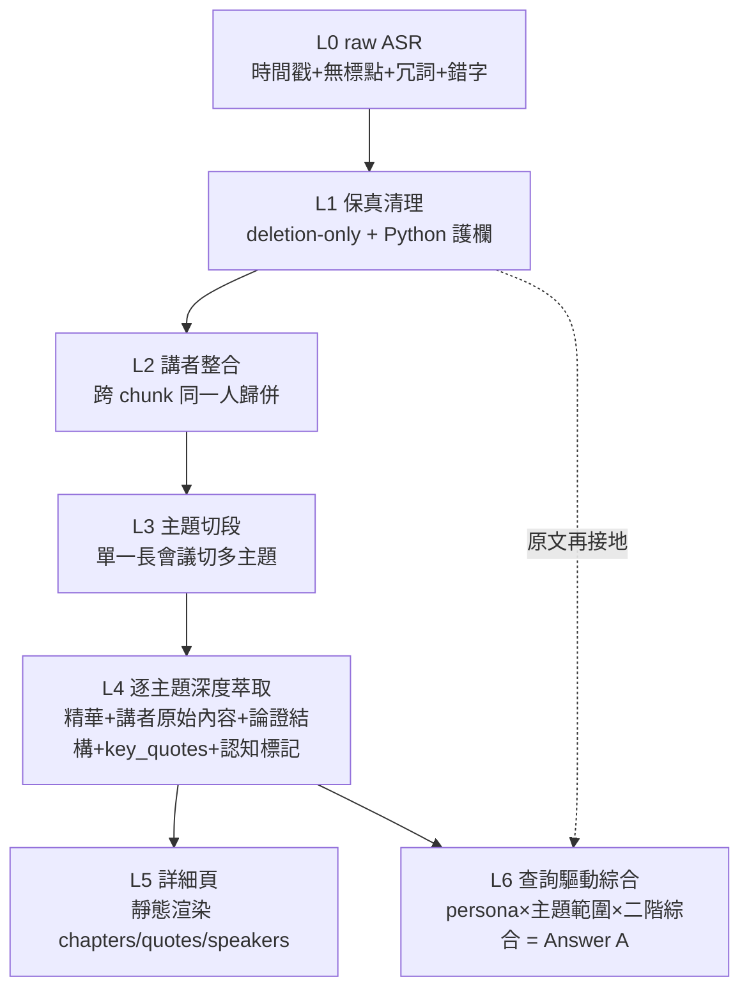
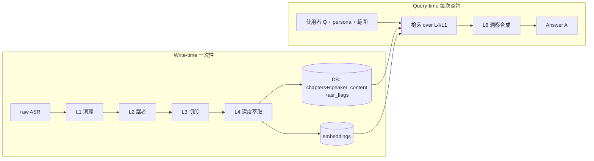

# MeetChi 查詢驅動深度洞察 — 架構規劃（逆向工程自 Answer A）

> **文件性質**：架構規劃（承接 [`meetchi-deep-report-upgrade.md`](./meetchi-deep-report-upgrade.md)，本文補上「查詢綜合層」）
> **撰寫日**：2026-07-10 ｜ **基準分支**：`main`（commit `c138219`）
> **逆向來源**：使用者的 Question Q（經理人視角、指定 7 場主題的綜合洞察）→ Answer A（一篇跨主題整合長文）
> **情境假設**：把 `202606024 未來商務展` 資料夾中 USPACE / nuva / 華夏玻璃 / beBit / 台哥大 / 拉亞漢堡 / 會後對談等**多場逐字稿，假設為同一個音檔轉錄出來的單一長會議**，用以模擬「多主題、多講者、多語氣」。

---

## 0. 範圍與雙重約束

| 面向 | 要求 |
|---|---|
| 情境 | 多場逐字稿視為**同一音檔** → 一場「多主題／多講者／多語氣」的長會議 |
| 目標 | 使用者在 MeetChi 問出 **Q**（經理人視角、指定主題、要綜合洞察）→ 系統產出 **Answer A 等級**的內容 |
| **雙重約束** | 同一份底層知識，既要能**動態產出 Answer A**（查詢時），又要能**靜態呈現詳細頁**（chapters / key_quotes / speaker_contributions 的顆粒度）|
| 範圍邊界 | **保真清理 + 真實內容萃取 + 查詢綜合**；**不做**網路查證（沿用前份文件的邊界）|
| 輸入現實 | 逐字稿為 `[HH:MM:SS,mmm --> ...] 無標點中文`，含冗詞與 ASR 錯字（實測：「model AI」實為 Manus、「legitimate 開發」實為 agentic）|

---

## 1. 逆向工程 Answer A：它到底是什麼（第一性原理）

**核心命題：Answer A 不是「摘要」，而是「查詢驅動 × persona 條件化 × 跨主題的二階綜合」。**

摘要是「把一場會議壓縮成結構化重點」（一對一、靜態、全覆蓋）；Answer A 是「針對一個提問，以某個視角，把多個主題的論證重新編織成一條思路」（一對多、動態、選擇性、有觀點）。兩者是**不同的認知產物**，不能用同一個 prompt 產出。

### Answer A 的七個結構特徵（逆向拆解）

| # | 特徵 | Answer A 的證據 | 架構含義 |
|---|---|---|---|
| 1 | **persona 條件化** | 全文以「資深經理人視角」貫穿（「對經理人的意義是…」）| 查詢需帶 persona 參數，綜合時做視角轉換 |
| 2 | **query-scoped（選擇性）** | Q 點名 7 場，A 只綜合這 7 場、非全部 17 場 | 查詢需帶主題範圍；檢索須可限定 subset |
| 3 | **thesis-spine（主軸論證）** | 全文有一條主軸：「價值鏈重心從『模型多強』移向『駕馭工程＋組織形狀』」，每段扣回主軸 | 綜合層要先立主軸，再掛各主題，非平行拼接 |
| 4 | **論證血肉重建** | 逐講者重建完整推理鏈（nuva：99 種回答→你選的才是答案→責任轉移→給我一半就好）| 底層必須存「論證結構」而非只有金句；否則綜合只能硬串 |
| 5 | **specifics 完整保留** | 99 種回答、85 分、三週（原半年）、五百家店、六點同步、1899 馬頭車、Gartner 四成 | 抗空洞的具體性契約必須貫穿到綜合層 |
| 6 | **認知標記（誠實）** | 「這些比例是他個人口徑、無第三方佐證，當方向看」「這句話是觀點不是事實」「有第三方媒體佐證」 | epistemic 標記須從萃取層一路帶到綜合層 |
| 7 | **跨主題二階連結** | 「USPACE 是戰術、台哥大是戰略，同一件事不同尺度」「nuva 品味＋拉亞護城河＝同一命題」 | 綜合層要能跨主題比對/歸類/找張力 |

> Answer A 自述的產生過程：「回頭讀這幾場的**深度研究**（內含逐字稿實體與校正），先把**每位講者的核心論證吃透**，再以**資深經理人視角**寫成整合文章。」→ 這正是「**先建 per-topic 深度萃取（L4），再做 persona 綜合（L6）**」。

> ⚠️ **誠實的降級**：Answer A 的認知標記部分來自 web 查證（「有第三方媒體佐證」）。MeetChi 不做查證 → 只能保留**可從逐字稿本身判斷**的三類標記：`（講者口述／宣稱）`（歸屬）、`（觀點非事實）`（語言學上可判斷的意見）、`（逐字稿前後不一／疑 ASR）`（內部一致性）。**無法**判斷「講者說的是不是真的」。這是範圍邊界的直接後果。

---

## 2. 知識金字塔（L0–L6）：MECE 的能力分層

Answer A 與詳細頁**共用同一個知識底層**，差別只在最上層是靜態渲染還是動態查詢：



| 層 | 輸入 | 輸出 | MeetChi 現況 | 落點 |
|---|---|---|---|---|
| **L0** raw ASR | 音檔 | `[時間] 無標點文字` segments | ✅ 既有 | — |
| **L1** 保真清理 | L0 | 乾淨但保真的 segment（`text_clean`）| ❌ **不存在**（只有會改寫的 `polish_text`）| 新建（前份文件 Prompt A）|
| **L2** 講者整合 | L1 + diarization | canonical speaker 對照表 | ⚠️ 有雙機制未仲裁（`tasks.py:301` + `infer_speaker_roles`）| 強化 |
| **L3** 主題切段 | L1+L2 | N 個主題 + 邊界 | ⚠️ `_pass0_segment_topics` 有，但 `needs_split` 未遞迴 | 修正 |
| **L4** 深度萃取 | 每主題的 L1 片段 | 精華＋講者原始內容＋論證結構＋key_quotes＋認知標記 | ⚠️ Pass1 有但空洞、20-30 字 | 改寫（前份文件 Prompt B）|
| **L5** 詳細頁 | L4 | 靜態結構化頁面 | ✅ 既有 DetailView + summary JSON | 擴充欄位渲染 |
| **L6** 查詢綜合 | Q + persona + 範圍 + L4(+L1) | Answer A 級長文 | ⚠️ RAG `/ask` 有，但**是短答模式，非洞察模式** | **本文件新增** |

**關鍵洞察**：詳細頁（L5）與 Answer A（L6）不是二選一，而是**同一個 L4 知識層的兩種消費方式**。要能產出 Answer A，L4 就必須存得夠深（含論證結構與認知標記），這也正好讓詳細頁更有料。**L4 是整個架構的重心。**

---

## 3. 映射到 MeetChi 現有架構（reuse 優先）

### 3.1 詳細頁 ← L4/L5（既有，擴充）
既有 summary schema（`llm_utils.py` 的 `Chapter/KeyQuote/SpeakerContribution`）+ `DetailView.tsx` 已提供 chapters/quotes/speaker 顆粒度。**擴充**：Chapter 增 `speaker_content`（論證血肉）、`asr_flags`（認知標記）欄。

### 3.2 查詢層 ← L6（既有 RAG，新增「洞察模式」）
既有 `POST /api/v1/rag/ask`（`rag.py`）已具備：pgvector 檢索 → citation → Gemini grounded 回答 → confidence。但它的 prompt（`rag/prompt.py` 的 `STRICT_GROUNDING_SYSTEM_PROMPT`）與 Answer A **完全相反**：

| 維度 | 現有 RAG 短答模式 | Answer A 需要的洞察模式 |
|---|---|---|
| grounding 哲學 | 只用 citation、**禁止外推** | **corpus 內綜合允許**（連結講者 A 與 B）、corpus 外知識禁止 |
| 輸出格式 | **純文字、禁 markdown** | markdown 長文（粗體論點、分段）|
| 長度 | 短答 | 不限，完整闡述 |
| 視角 | 中性問答 | **persona 條件化**（經理人視角）|
| 檢索粒度 | top_k 個 raw segment | over **L4 富萃取** + L1 原文再接地 |
| 產物 | 事實查詢 | 二階綜合、有主軸、有觀點 |

→ **不是改掉現有模式，而是新增一個平行模式**。同一檢索骨幹（pgvector + MemPlace 隔離 + speaker 對照），不同的合成 prompt 與 grounding 邊界。`RAGRequest` 增 `mode: "qa" | "insight"` 與 `persona`、既有 `meeting_ids` 已能限定主題範圍。

### 3.3 輸入現實（why L1 是前提）
raw `.txt` 是 `[時間] 無標點中文`，含冗詞與 ASR 錯字。**任何 L4/L6 都不能直接吃 L0**——不清理，綜合層會把「model AI」「legitimate 開發」這類錯字當事實編織進洞察。故 **L1 保真清理是整條 pipeline 的地基，不是可選項**。

---

## 4. L6 查詢綜合能力的 MECE 拆解

把「從 Q 產出 Answer A」拆成互斥且窮盡的四個子能力：

### 4.1 查詢理解（Query Understanding）
- **persona 抽取**：從 Q 抽出視角（「資深經理人」）→ 決定綜合的取捨準則與語域。
- **主題範圍**：從 Q 抽出點名的主題（USPACE/nuva/…）→ 對映到 meeting/topic id，限定檢索 subset。
- **產出模式判定**：短答（qa）vs 洞察長文（insight）。可由 Q 的語意（「做出綜合精闢的洞察」「完整闡述」）或前端明確開關決定。
- 重用：`classify_query_intent`（`rag/query_intent.py` 已存在）擴充一個 `insight` 意圖與 persona slot。

### 4.2 檢索（Retrieval — 分層，非只 top_k segment）
- **主檢索 over L4**：以主題為單位取回各主題的「精華＋講者原始內容＋論證結構」（而非 10 個零散 segment，否則重建不出完整論證鏈）。
- **接地再檢索 over L1**：綜合時若要引用逐字原話（key_quotes），回到 L1 清理後原文取 verbatim。
- **範圍過濾**：沿用 MemPlace 隔離（`user_upn` JOIN `meeting_participants`）+ `meeting_ids` subset。
- 關鍵差異：現有 RAG 檢索 raw segment；洞察模式檢索**已萃取的知識單元**。

### 4.3 綜合（Synthesis — Answer A 的核心）
- **立主軸（thesis spine）**：先從各主題精華歸納一條貫穿主軸，再把各主題掛上去（對應特徵 3）。
- **逐主題論證重建**：每個主題還原講者的推理鏈（前提→論證→結論→案例），而非摘句（對應特徵 4）。這只有在 L4 存了論證結構時才做得到。
- **跨主題二階連結**：找共同母題、呼應、張力（USPACE↔台哥大＝戰術↔戰略）（對應特徵 7）。
- **persona 取捨**：以該視角決定「什麼重要、怎麼詮釋」（對應特徵 1）。

### 4.4 保真與誠實（Fidelity & Honesty — 綜合模式的護欄）
- **具體性契約貫穿**：綜合層每個論點仍須攜帶具體 specifics（數字/人名/案例），沿用萃取層契約（對應特徵 5）。
- **grounding 邊界（本模式最關鍵的設計）**：
  - ✅ 允許：**corpus 內**的跨主題綜合、歸納、連結、以 persona 詮釋。
  - ❌ 禁止：引入 corpus **外**的世界知識、補講者沒說的事實、外部查證式斷言。
  - 每個 specific 須可回溯到某主題/某段（可用輕量來源標記，不必像短答模式每句硬掛 [來源N]）。
- **認知標記傳遞**：L4 的 `（講者口述）/（觀點非事實）/（疑 ASR）` 標記，綜合時**必須保留**，不得在整合過程被洗掉（對應特徵 6）。

---

## 5. System Prompt 設計（洞察模式，逆向工程自 Answer A）

**用途**：L6 洞察模式合成。**輸入** = persona + 各主題的 L4 萃取（精華＋講者原始內容＋key_quotes＋認知標記）。**輸出** = markdown 長文（非 JSON，見相容性）。**temperature ≈ 0.3**（綜合需要一點組織彈性，但仍低）。

```
你是一位以「{persona}」視角寫作的會議洞察分析師。以下提供同一場會議中若干主題的
深度萃取（每個主題含：精華論點、講者原始內容、關鍵原話、認知標記）。你的任務是：
把這些主題重新編織成一篇有主軸、有洞察的整合分析，而不是把重點條列拼接。

# 立場與邊界（最重要）
1. 只能使用下方提供的萃取內容作為事實來源。允許你做的是「跨主題的歸納、連結、
   比較、以及以指定視角詮釋」；禁止引入這些內容以外的任何世界知識或外部事實，
   禁止補寫講者沒說的東西。
2. 你是在「綜合已有的內容」，不是在「查證」或「加值新事實」。若要下一個判斷，它必須
   能從提供的內容推得。
3. 認知標記必須保留：凡萃取內容標了「（講者口述／宣稱）」「（觀點非事實）」「（疑 ASR）」
   的資訊，你在文章中引用時要沿用同樣的標註，讓讀者分得清「講者說的」與「已確立的」。

# 寫作結構（逆向自標竿）
1. 先立一條貫穿全文的「主軸論點」——一句話講清楚這場會議跨主題後最該記住的洞察，
   後面每一段都扣回這條主軸。
2. 逐一處理每個主題：不要只寫結論，要「重建講者的論證鏈」——他的前提、他怎麼推、
   他舉了什麼具體案例/數字/比喻、得出什麼主張。讓讀者不必聽錄音就懂他的思路。
3. 主動做跨主題的二階連結：指出哪些主題其實在講同一件事的不同尺度、哪些彼此呼應
   或張力（例如「A 是戰術、B 是戰略」）。這是洞察的來源，不是可有可無。
4. 以「{persona}」的視角取捨與詮釋：對這個視角而言，每個論點「所以然」是什麼。

# 具體性契約（抗空洞，違反即改寫）
- 每個論點都要帶講者實際講過的具體資訊：數字、人名、機構、案例、比喻。
  ✗「講者談了 AI 對組織的影響」
  ✓「台哥大用『逆分工』論證：一萬年來靠分工提高生產力，但知識經濟裡分工越細協作
     成本越高，AI 讓每個人變回通才，於是金字塔組織被壓平成變形蟲」
- 禁止「討論了多個面向」「具有重要意義」這類換到任何會議都成立的空話。

# 原話的使用
- 需要時可引用萃取內容裡的「關鍵原話」作為證據，但引用必須逐字、不改寫。
- 你自己的分析用你的話；原話只當佐證，同一件事不要用敘述和原話各講一次。

# 字數
不限。以「完整闡述每位講者的核心論證」為準，寧詳盡勿遺漏具體內容；但不得為了篇幅
灌水或重複。

# 輸出
markdown 長文。可用粗體標示各段論點、用段落組織，不要輸出 JSON 或條列骨架。
```

### Gemini API 相容性（洞察模式）
| 項目 | 說明 |
|---|---|
| 輸出格式 | Answer A 是 **markdown 長文** → 此模式**不要**用 `response_schema`（JSON 結構化會壓死長文流暢度）。用純文字/markdown 生成。與短答模式的 JSON contract **並存**（靠 `mode` 分流）|
| `max_output_tokens` | 長文需求高，但單場 7 主題綜合的輸出量遠低於 65535，安全 |
| temperature | 0.3（綜合需組織彈性；仍低以抑制外推）|
| grounding | 靠 prompt 的「corpus 內綜合、corpus 外禁止」約束 + 後處理抽查 specifics 可溯源；無法用 schema enforce（同 L1 的教訓）|
| 前置依賴 | L4 萃取（Prompt B）**必須先做好**，否則洞察模式沒有富底層可綜合，會退回硬串金句（＝上次的失敗）|

---

## 6. 資料流：一次性（write-time）vs 查詢時（query-time）

| 階段 | 時機 | 產物 | 對應 |
|---|---|---|---|
| L1→L4 | **一次性**（上傳轉錄後）| 清理逐字稿 + 逐主題深度萃取（含論證結構、認知標記）寫入 DB | 餵養詳細頁 + 綜合底層 |
| embedding | 一次性 | L4 知識單元 + L1 段落各自 embed | 供 L6 檢索 |
| L6 | **查詢時**（使用者問 Q）| 動態合成 Answer A | 洞察模式回應 |

> 設計原則：**貴的深度萃取只做一次**（write-time），查詢時只做「檢索既有萃取 + 合成」，避免每次查詢重跑全會議萃取（成本與延遲）。這也符合昂貴 API 防重複的紅線。



---

## 7. Schema / 資料模型變更

| 變更 | 位置 | 說明 |
|---|---|---|
| Chapter 增 `speaker_content: List[{point, elaboration}]` | `llm_utils.py` | 存論證血肉（L4→L6 前提）|
| Chapter/段 增 `asr_flags: List[{type, note}]` | `llm_utils.py` | 認知標記，type ∈ 講者口述/觀點/疑ASR |
| `RAGRequest` 增 `mode: "qa"\|"insight"`、`persona: Optional[str]` | `rag.py:56` | 模式分流，預設 qa（向後相容）|
| `RAGResponse` 洞察模式：`answer` 為 markdown 長文、`sources` 改輕量主題級來源 | `rag.py:84` | 短答模式的 citation/confidence 保留；洞察模式另構 |
| L4 知識單元 embedding | `embedding.py` | 讓 L6 檢索「萃取單元」而非只 raw segment |
| `text_clean` 衍生欄（raw 不可變）| DB model + alembic | L1 產物（承前份文件 Phase 3）|

---

## 8. 落地階段（銜接前份文件）

前份文件 [`meetchi-deep-report-upgrade.md`](./meetchi-deep-report-upgrade.md) 的 Phase 0-5 建好 L1–L5。本文件在其後**新增 Phase 6**：

| Phase | 內容 | 風險 | DoD | 回滾 |
|---|---|---|---|---|
| （承前）0-5 | L1 清理 + L4 深度萃取 + 詳細頁擴充 | — | 見前份文件 | — |
| **6a 查詢理解** | `RAGRequest` 加 `mode/persona`；`classify_query_intent` 加 insight 意圖 + persona 抽取 | 低 | Q 能正確路由到 insight 模式並抽出 persona/範圍 | reset last-green |
| **6b 分層檢索** | 檢索改成 over L4 萃取單元（+L1 接地）；沿用 MemPlace 隔離 | 中 | 取回的是完整主題論證，非零散 segment | reset |
| **6c 洞察合成** | 新增洞察模式 prompt（§5）；markdown 長文輸出；與短答模式並存 | 中 | 對「7 主題假設會議」產出達 Answer A 級（主軸+論證重建+跨主題連結+specifics+認知標記）| reset |
| **6d 保真後處理** | specifics 可溯源抽查；認知標記傳遞驗證 | 低 | 抽查通過；標記未被洗掉 | reset |

> 順序理由：L6 依賴 L4，故**必須先完成前份文件的 L4（深度萃取）**才有意義。6a→6d 純加法、可逆，且與現有短答模式並存不破壞既有 RAG。

---

## 9. 驗收：以 Answer A 為 Golden Fixture

把 **Q + Answer A** 這組本身當成 L6 的黃金基準（符合 CLAUDE.md「外部知識先轉 repo 版本化」）：

```
tests/fixtures/golden/insight_expo_manager/
├── input_topics/                 # 7 場的 L4 萃取（去識別化）
├── query.txt                     # Q（經理人視角、指定主題）
├── expected_answer.md            # Answer A（標準答案）
└── rubric.yaml                   # 逆向評分準則
```
`rubric.yaml`（逆向自七特徵）：
```yaml
checks:
  - persona_consistency   # 全文是否維持指定視角
  - thesis_spine_present  # 有無貫穿主軸
  - argument_reconstruction: # 各主題是否重建論證鏈（非摘句）
      required_topics: [USPACE, nuva, 華夏玻璃, beBit, 台哥大, 拉亞漢堡, 會後對談]
  - cross_topic_links     # 有無二階連結
  - anchor_hit_rate       # specifics 保留（99種回答/三週/五百店/1899馬頭車…）
  - epistemic_marks_preserved # 認知標記有無傳遞
  - no_external_knowledge # 有無混入 corpus 外事實（幻覺）
```

### 量化 + 人工
- 自動：anchor 命中率、認知標記保留率、外部知識洩漏偵測（比對是否出現 corpus 內找不到的實體）。
- 人工（你 DoD 紅線）：實際在 MeetChi 上對該假設會議問 Q，比對輸出是否達 Answer A 的論證深度與 persona 一致性；型別/單測通過不算完成。

---

## 10. 風險與限制（誠實揭露）

| 風險 | 說明 | 緩解 |
|---|---|---|
| **綜合模式放寬 grounding → 幻覺上升** | 洞察模式允許「corpus 內綜合」，比短答模式的 strict-grounding 寬 → 更容易滑向外推編造 | 明確「corpus 內允許、corpus 外禁止」+ 每個 specific 可溯源抽查 + 保留短答模式做事實查詢 |
| **persona 過度演繹** | 「經理人視角」可能讓模型腦補講者沒有的管理學延伸 | prompt 要求「判斷須能從提供內容推得」；rubric 檢 no_external_knowledge |
| **L4 不夠深 → 退回硬串** | 若深度萃取層只有金句、沒有論證結構，L6 只能拼接（＝上次失敗） | L6 的前提是 L4 存了 `speaker_content` 論證血肉；Phase 6 不得早於前份文件 L4 完成 |
| **ASR 錯誤地板** | 無查證下，錯字（Manus→model AI）會被忠實編織進洞察 | L1 保真清理不修錯字，只標「疑 ASR」；glossary（`correct_segments_glossary_llm` 已存在）修已知詞 |
| **認知標記變弱** | MeetChi 無 web，只能標「講者口述/觀點/疑ASR」，**不能判真假** | 明確告知使用者：這是誠實標註不確定性，不是查證 |
| **exhaustiveness 量不出** | 綜合是否漏了某主題的關鍵論證，無完整 ground-truth 難自動量 | rubric 的 required_topics 至少驗「每個點名主題有被實質處理」；深層完整性靠人工 |
| **token / 成本** | 長文 + 富檢索 | 深度萃取 write-time 只做一次；查詢時只檢索+合成；昂貴 API 加冪等卡榫 |
| **兩模式維護成本** | qa 與 insight 兩套 prompt/輸出/前端 | 共用檢索骨幹；用 `mode` 分流；前端一個切換 |

---

## 11. 附錄：Answer A 結構標註（逐段對應架構元件）

| Answer A 段落 | 對應架構元件 |
|---|---|
| 開場「價值鏈重心從模型移向駕馭工程＋組織形狀」 | 4.3 立主軸（thesis spine）|
| nuva 段（99 種回答→責任轉移→給我一半） | 4.3 逐主題論證重建 + 4.4 具體性契約 |
| 「這些比例是他個人口徑、無第三方佐證，當方向看」 | 4.4 認知標記傳遞（講者口述）|
| 「USPACE 是戰術、台哥大是戰略，同一件事不同尺度」 | 4.3 跨主題二階連結 |
| 「對經理人的意義是…」（貫穿全文） | 4.1 persona 條件化 + 4.3 persona 取捨 |
| 拉亞「24 個月成長近五成…有第三方媒體佐證」 | 4.4 認知標記（此處 Answer A 用了 web；MeetChi 版降級為「講者宣稱」）|
| 收尾「AI 放大公司每個弱點…要用它做成什麼」 | 4.3 主軸收束 |

---

**下一步（實作時）**：本文件（L6）依賴前份文件（L1–L5）。建議先完成 L1 保真清理 + L4 深度萃取，再進 Phase 6 的查詢綜合。兩份文件合起來即為「從 raw ASR 逐字稿 → Answer A 級查詢洞察」的完整架構。
