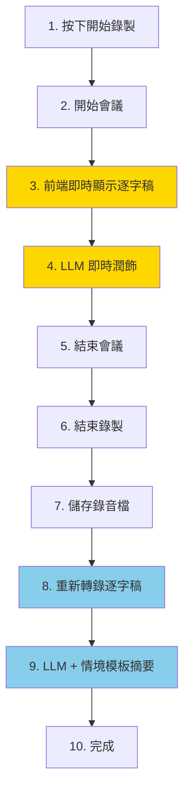

# MeetChi 使用者情境與基礎設施分析

> 版本：v1.0 | 日期：2026-02-04

## 1. 使用者情境流程



### 步驟說明

| 步驟 | 動作 | 處理位置 | 等待性質 |
|------|------|---------|---------|
| 1 | 按下開始錄製 | Frontend | 同步（即時） |
| 2 | 開始會議 | Frontend | 同步（即時） |
| 3 | 即時顯示逐字稿 | LLM Service (ASR) | **串流**（WebSocket） |
| 4 | LLM 即時潤飾 | LLM Service | **串流**（WebSocket） |
| 5 | 結束會議 | Frontend | 同步（即時） |
| 6 | 結束錄製 | Frontend | 同步（即時） |
| 7 | 儲存錄音檔 | Backend + GCS | 非同步（可背景） |
| 8 | 重新轉錄逐字稿 | LLM Service (ASR) | **重處理**（1-5 分鐘） |
| 9 | LLM 情境摘要 | LLM Service | **重處理**（30-60 秒） |
| 10 | 完成 | Frontend | 同步（即時） |

---

## 2. 第一性原理分析：Celery + Redis 是否必要？

### 2.1 什麼是任務佇列的本質需求？

任務佇列解決的核心問題是「**解耦請求與處理**」：

```
請求 → 佇列 → 處理 → 結果
         ↑
    (非同步緩衝)
```

**本質問題**：用戶是否需要**立即**得到結果？

### 2.2 MECE 分析：各步驟的處理模式

| 分類 | 步驟 | 用戶等待容忍度 | 處理時間 | 結論 |
|------|------|---------------|---------|------|
| **即時串流** | 3, 4 | 0（必須即時） | 持續進行 | ❌ 不需要佇列 |
| **短暫同步** | 1, 2, 5, 6, 10 | 0-1 秒 | < 1 秒 | ❌ 不需要佇列 |
| **可延遲** | 7 | 可接受背景 | 數秒 | ⚠️ 可選佇列 |
| **長時非同步** | 8, 9 | 可接受數分鐘 | 1-5 分鐘 | ✅ 需要非同步 |

### 2.3 關鍵問題：步驟 8, 9 的處理方式

#### 選項 A：同步處理（目前可能的實作）

```
用戶點擊「產生摘要」→ 等待 1-5 分鐘 → 得到結果
```
- **優點**：架構簡單、無需 Redis
- **缺點**：用戶體驗差、HTTP 可能超時

#### 選項 B：輪詢（Polling）

```
用戶點擊 → API 返回 task_id → 前端定時查詢狀態 → 完成後取結果
```
- **優點**：不需要 Redis，可用 DB 追蹤狀態
- **缺點**：浪費請求、延遲較高

#### 選項 C：Celery + Redis（現有設計）

```
用戶點擊 → 任務進入 Redis 佇列 → Worker 處理 → 完成後通知
```
- **優點**：專業、可擴展、可靠
- **缺點**：成本高（Redis ~$35-50/月）

#### 選項 D：Cloud Tasks（GCP 原生）

```
用戶點擊 → Cloud Tasks 佇列 → Cloud Run 處理 → 完成後通知
```
- **優點**：無服務成本（100 萬次免費）、GCP 原生整合
- **缺點**：需改寫程式碼

---

## 3. 結論與建議

### 3.1 MeetChi 是否需要任務佇列？

| 問題 | 答案 |
|------|------|
| 步驟 3-4（即時串流）需要佇列嗎？ | ❌ 不需要，WebSocket 串流處理 |
| 步驟 8-9（重處理）需要佇列嗎？ | ⚠️ **看設計** |

**如果**用戶可以接受「點擊後等待 1-5 分鐘才看到結果」→ 不需要佇列
**如果**要求「點擊後立即返回，背景處理完通知」→ 需要佇列

### 3.2 成本優化建議

| 方案 | 月費 | 適用情境 |
|------|------|---------|
| **移除 Redis + Celery** | -$35-50 | 小團隊、可接受等待 |
| **改用 Cloud Tasks** | 免費 | 需要非同步但控制成本 |
| **保留 Redis + Celery** | ~$50 | 大規模、高可靠需求 |

### 3.3 建議優先級

1. **短期**：確認目前後端是否真正使用 Celery
2. **中期**：若未使用，從 Terraform 移除 Redis
3. **長期**：若需要非同步，評估 Cloud Tasks 替代方案

---

## 4. 什麼情境下需要 Celery + Redis？

| 情境 | 需要程度 |
|------|---------|
| 單一用戶、小規模 | ❌ 不需要 |
| 多用戶同時產生摘要（>10 並發） | ⚠️ 考慮使用 |
| 需要任務重試、失敗處理 | ✅ 需要 |
| 需要排程任務（每日報告） | ✅ 需要 |
| 需要任務優先級管理 | ✅ 需要 |
| 需要分散式處理（多 Worker） | ✅ 需要 |
