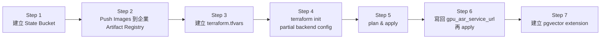

# 企業內部 GCP 部署指南（Enterprise Setup）

本文件說明如何將 MeetChi 從目前的個人 / 公開 GCP 環境（`project-51769b5e-7f0f-4a2f-80c`）遷移到**企業內部 GCP project**。

> 一般情境（個人 / 開發）的部署流程請看 `terraform/DEPLOYMENT.md`，本文僅針對企業搬遷的差異點。

---

## 1. 為什麼不能直接 `terraform apply`

當前 `terraform/` 內有 **3 處與來源環境耦合**，企業端不能直接套用：

| 位置 | 寫死的內容 | 企業端必須做的事 |
|---|---|---|
| `main.tf:16-19` | `backend "gcs" { bucket = "meetchi-terraform-state" }` | Terraform 不允許 backend block 用變數，企業端用 **partial backend config** 在 `terraform init` 時覆寫 bucket 名稱（見 §4） |
| `variables.tf:31, 37, 43` | `backend_image` / `gpu_asr_image` / `llm_service_image` 預設值指向來源 project 的 Artifact Registry | 在 `terraform.tfvars` 覆寫為企業內 Artifact Registry 路徑 |
| `terraform.tfvars`（被 gitignore） | 含 `db_password`、`hf_auth_token`、`secret_key`、`gemini_api_key` 等 secrets | 從 `terraform.tfvars.enterprise.example` 複製後重新填入企業值 |

此外：企業 GCP project 上**完全沒有 state**，第一次 apply 視為「全新建立」，所有資源（Cloud SQL、Cloud Run、VPC、Bucket）都會新長一份。**現有環境的資料不會自動遷移**。

---

## 2. 前置條件

| 項目 | 說明 |
|---|---|
| 企業 GCP project | 已建立，例如 `enterprise-meetchi-prod` |
| Billing 已連接 | 否則 API enable 會失敗 |
| 工具 | `gcloud >= 400.0`、`terraform >= 1.0` |
| 帳號 | 已 `gcloud auth login` 並 `gcloud auth application-default login` |
| IAM | `roles/owner` 或以下組合：`roles/cloudsql.admin` + `roles/run.admin` + `roles/artifactregistry.admin` + `roles/secretmanager.admin` + `roles/storage.admin` + `roles/cloudtasks.admin` + `roles/serviceusage.serviceUsageAdmin` |
| GPU quota | 若需 Cloud Run GPU，先在 console 申請 `NvidiaL4GpuAllocPerProjectRegion` quota（須選 GPU-supported region） |

---

## 3. 步驟總覽



---

## 4. Step 1 — 建立 Terraform State Bucket

State bucket 名稱**全域唯一**，建議命名 `<project-id>-terraform-state`。

```bash
export PROJECT=enterprise-meetchi-prod        # 改成企業實際 project id
export REGION=asia-east1                       # 改成企業實際 region

gcloud config set project $PROJECT

gcloud storage buckets create gs://${PROJECT}-terraform-state \
  --project=${PROJECT} \
  --location=${REGION} \
  --uniform-bucket-level-access

# 啟用 versioning（state 檔誤改後可回退）
gcloud storage buckets update gs://${PROJECT}-terraform-state --versioning
```

---

## 5. Step 2 — Push Container Images 到企業 Artifact Registry

```bash
# 5.1 建立 Artifact Registry repo
gcloud artifacts repositories create meetchi \
  --repository-format=docker \
  --location=${REGION} \
  --project=${PROJECT}

# 5.2 取得 repo URL
export REPO=${REGION}-docker.pkg.dev/${PROJECT}/meetchi

# 5.3 設定 docker auth
gcloud auth configure-docker ${REGION}-docker.pkg.dev

# 5.4 Build & push（在 repo root 執行；image tag 自行決定）
gcloud builds submit --config=cloudbuild-gpu.yaml \
  --substitutions=_REPO=${REPO},_TAG=v1.0.0 \
  --project=${PROJECT}
```

> ⚠️ `cloudbuild-gpu.yaml` 內若有 hardcode 的 project id，需先檢查並覆寫 `_PROJECT` substitution。

---

## 6. Step 3 — 建立 `terraform.tfvars`

```bash
cd terraform
cp terraform.tfvars.enterprise.example terraform.tfvars
# 編輯 terraform.tfvars，將所有 <REPLACE_ME_*> 換成企業實際值
```

**檢查清單**：
- [ ] `project_id` = 企業 project id
- [ ] `region` 與 GPU quota 所在 region 一致
- [ ] 三個 image URL 指向企業 Artifact Registry（`${REGION}-docker.pkg.dev/...`）
- [ ] `hf_auth_token`、`secret_key`、`gemini_api_key` 已填入

---

## 7. Step 4 — `terraform init` with Partial Backend Config

由於 `main.tf` 的 backend bucket 寫死，**不能直接 `terraform init`**，必須用 partial backend config 覆寫：

```bash
terraform init -reconfigure \
  -backend-config="bucket=${PROJECT}-terraform-state" \
  -backend-config="prefix=terraform/state"
```

> `-reconfigure` 確保不繼承本地殘留的 backend 設定。

---

## 8. Step 5 — Plan & Apply

```bash
terraform plan -out tfplan
# 仔細檢查 plan：應為 + create 大量資源、無 destroy
terraform apply tfplan
```

> ⚠️ 若 plan 出現任何 `destroy` 的項目，**立即停止並回報**，不要 apply。

---

## 9. Step 6 — 第二次 Apply（寫回 GPU ASR URL）

GPU ASR service URL 在第一次 apply 才會生成，需取出後寫回 tfvars 再 apply：

```bash
# 取得 GPU ASR URL（從 module 內查；若 outputs 沒導出，可用下列指令）
gcloud run services describe meetchi-gpu-asr \
  --region=${REGION} --project=${PROJECT} \
  --format='value(status.url)'

# 編輯 terraform.tfvars，將 gpu_asr_service_url = "..." 設為上述 URL
terraform apply
```

---

## 10. Step 7 — 建立 pgvector Extension

PostgreSQL flag `cloudsql.enable_pgvector=on` 已由 terraform 設定（`database.tf:14-17`），但仍需在 DB 內手動 `CREATE EXTENSION`：

```bash
gcloud sql connect meetchi-db-pg --user=postgres --project=${PROJECT}

# 進入 psql 後：
\c meetchi
CREATE EXTENSION IF NOT EXISTS vector;
\dx                                  -- 確認 vector extension 已存在
```

---

## 11. 來源 vs 企業環境差異速查

| 項目 | 個人 / 公開 GCP | 企業內部 GCP |
|---|---|---|
| Project ID | `project-51769b5e-7f0f-4a2f-80c` | `<企業 project id>` |
| Region | `asia-southeast1`（Singapore） | 視政策；GPU 需求請保留 `asia-southeast1` 或 `us-central1` |
| State bucket | `meetchi-terraform-state` | `<project-id>-terraform-state` |
| Image registry | `asia-southeast1-docker.pkg.dev/project-51769b5e.../meetchi/...` | `<region>-docker.pkg.dev/<project>/meetchi/...` |
| 認證帳號 | 個人 Google account | 企業 SSO / Service Account |
| 資料 | 在來源環境的 Cloud SQL / GCS | **不會自動帶過來**，需另外 dump & restore |

---

## 12. 資料遷移（Optional）

若企業端要繼承來源環境的會議資料：

| 資料 | 遷移方式 |
|---|---|
| Cloud SQL（PostgreSQL） | `gcloud sql export sql` 從來源、`gcloud sql import sql` 到企業；注意 `vector` extension 與 schema 版本一致 |
| GCS audio bucket | `gcloud storage cp -r gs://<source-bucket>/* gs://<enterprise-bucket>/` |
| GCS db bucket（SQLite） | 同上 |
| Secret Manager | 在企業端重建 secret，**勿**把來源 secret 直接 `gcloud secrets versions access` 後 echo 到企業（過程會經過本機，違反企業 secret 隔離） |

---

## 13. 已知地雷

- ❌ **不要** 直接複製來源環境的 `terraform.tfstate` 到企業 bucket — 內含 resource self-link 帶有來源 project id，apply 會報錯或誤刪資源。
- ❌ **不要** 在企業 prod 環境執行 `terraform destroy`（會清空整套 infra）。
- ❌ **不要** 把 `terraform.tfvars` commit 到 git（已在 `.gitignore`）。
- ⚠️ `database_flags.cloudsql.enable_pgvector` 變更會觸發 Cloud SQL **重啟**（短暫斷線）；首次部署無影響，事後修改要安排維護視窗。
- ⚠️ `asia-east1`（Taiwan）目前**不支援** Cloud Run GPU；若企業政策必須在 Taiwan，GPU 服務需另外規劃（例如改用 GKE + GPU node pool，或將 GPU workload 留在 `asia-southeast1`）。

---

## 14. 回滾策略

| 情境 | 動作 |
|---|---|
| Apply 出錯、想回到 apply 前狀態 | State bucket 已啟用 versioning，從 GCS object versions 還原 `terraform/state/default.tfstate` |
| 要整套刪掉重來（**僅限非 prod**） | `terraform destroy`，再從 Step 5 重 apply |
| 想暫停部署但保留資源 | `min_instances = 0` 已是預設，Cloud Run 會自動 scale-to-zero；Cloud SQL 仍持續計費，須另外 stop |

---

## 15. 維護者聯絡

部署過程遇到問題，先檢查：
1. `gcloud config list` — 確認 project / account 是否切到企業環境
2. `terraform state list` — 確認 state 內已有資源
3. Cloud Build / Cloud Run logs — 確認 image pull 與 service 啟動是否成功
